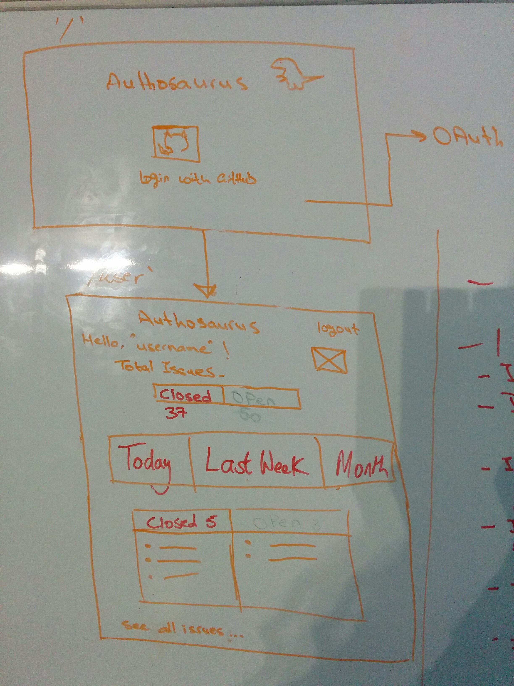

# Authosaurus's velocity tracker

# Setup

1. Clone this repo and ```cd velocity-tracker```.
2. Run npm install.
3. Add config.env (ask us for details).
4. Start server by running ```npm run devStart```.

# What?
Our app is velocity tracker for github user displaying this user issues and to help compare open issues with close ones.

# User Story

- As a Github user I want to track the issues I've been assigned to, so that I can monitor my progress.

### Sub user stories

- I can go to Authosaurus page,
- I can login with Github,
- I can logout from the user page,
- I want to see the total number of issues I've been assigned to,
- I want to see how many of thoses issues are closed and how many are open,
- I want to view issues filtered by time (today, las week, last month),
- I want to see today's issues as a default,
- I can change the default option to last weeks's issues or last month's,
- I want to be able to see a list of all the issues (streach goal).



### Endpoints

- **/** - landing page,
- **/login** - authorise user with Github, redirect to '/user',
- **/user** - view user name and image, open vs. closed issues

### Database

**Table 1. Users**

|name            |  type             |
|----------------|-------------------|
|**user_id**     |PRIMARY KEY        |   
|**user_name**   |string             |
|**user_img**    |string             |   
|**token**       |string             |  

**Table 2. Issues**

|name            |  type             |
|----------------|-------------------|
|**issue_id**    |PRIMARY KEY        |   
|**title**       |string             |
|**created_at**  |time stamp         |   
|**opened**      |boolean            |   


# How?

- Authentication via Github using the OAuth module
